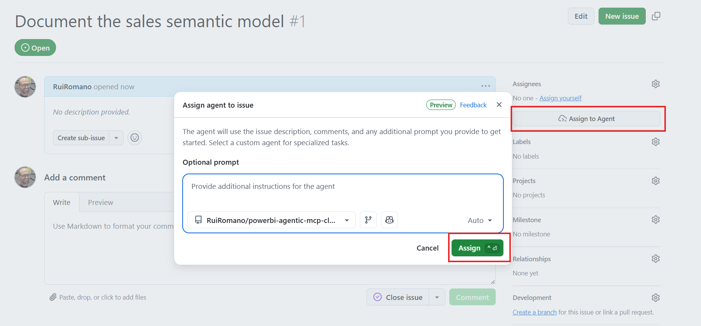
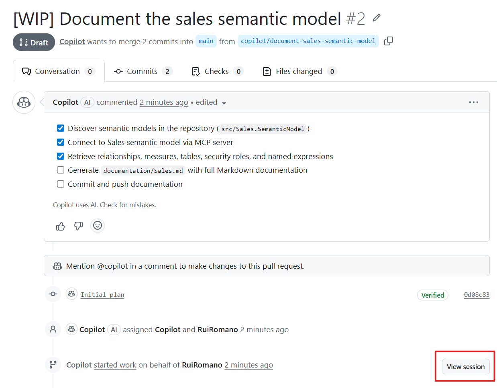
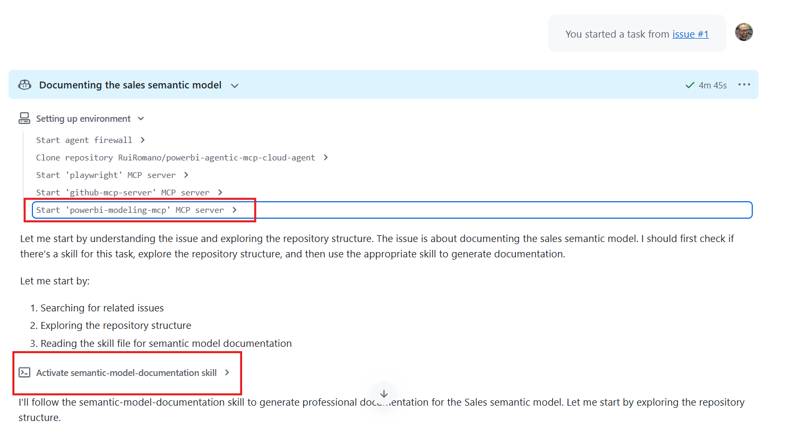
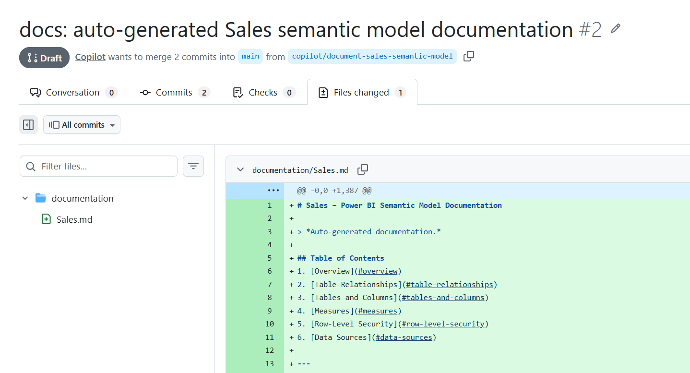

# Agentic Power BI Development with GitHub Copilot Coding Agent

Learn how to Power BI semantic model tasks - documentation, naming audits, and more - to [GitHub Copilot coding agent](https://docs.github.com/en/copilot/concepts/agents/cloud-agent/about-cloud-agent), powered by the [Power BI Modeling MCP Server](https://github.com/microsoft/powerbi-modeling-mcp). Open a GitHub issue, assign it to the agent, and review the pull request it delivers.

## How It Works

This template combines three pieces:

1. **Power BI project in PBIP format** - the semantic model and report source code, stored as [Power BI Project](https://learn.microsoft.com/en-us/power-bi/developer/projects/projects-overview) files in `src/`.
2. **Power BI Modeling MCP Server** - gives the coding agent programmatic access to the semantic model (tables, measures, relationships, RLS, etc.).
3. **Skills** - curated step-by-step workflows in [`.github/skills/`](.github/skills/) that guide the agent to produce consistent, team-standard results.

## Getting Started

1. **Create your repository** - Click **Use this template** and select **Create a new repository** in your GitHub account.

2. **Configure the MCP server** - Navigate to **Settings > Copilot > Cloud Agent** and paste the following into **MCP configuration**:

    ```json
    {
        "mcpServers": {
            "powerbi-modeling-mcp": {
                "type": "stdio",
                "command": "npx",
                "args": [
                    "-y",
                    "@microsoft/powerbi-modeling-mcp",
                    "--start"
                ],
                "tools": ["*"]
            }
        }
    }
    ```

    Click **Save MCP Configuration**.

3. **Create an issue and assign the agent** - Open a new GitHub issue describing the task you want performed on the semantic model.

    **Example issues:**

    > Generate documentation for the Sales semantic model

    > Analyze the naming conventions of the Sales semantic model and propose changes

    Then assign the issue to the coding agent:

    

4. **Review the pull request** - Copilot creates a branch, executes the task, and opens a PR for your review:

    

    You can open the Copilot session log to verify that the [skills](.github/skills/) and [Power BI Modeling MCP](https://github.com/microsoft/powerbi-modeling-mcp) were loaded successfully:

    

    The agent follows the instructions defined in the skills, so the output conforms to your team's standards:

    

> [!TIP]
> - Try creating issues from your smartphone - you can delegate tasks to the coding agent from anywhere and focus on reviewing the results.
> - This is a starting point. Customize the skills and add new ones to match your team's development standards and workflows.
> - Learn more about the GitHub coding agent in the [official documentation](https://docs.github.com/en/copilot/concepts/agents/cloud-agent/about-cloud-agent).

## Available Skills

| Skill | Description |
|-------|-------------|
| [semantic-model-documentation](.github/skills/semantic-model-documentation/SKILL.md) | Generates professional Markdown documentation including table relationships, measures, RLS rules, and data sources. |
| [standardize-naming-conventions](.github/skills/standardize-naming-conventions/SKILL.md) | Audits and fixes naming conventions across tables, columns, measures, and display folders. |

You can add your own skills to `.github/skills/` to extend the agent's capabilities for your team's workflows.

## Acknowledgments

- [semantic-model-documentation skill](.github/skills/semantic-model-documentation/SKILL.md) was copied from [John Kerski](https://www.linkedin.com/in/john-kerski) repo [github-agentic-workflow-power-bi-mcp-example](https://github.com/clientfirsttech/github-agentic-workflow-power-bi-mcp-example/tree/main)
- [standardize-naming-conventions skill]() was copied from [Kurt Buhler](https://www.linkedin.com/in/kurtbuhler) repo [power-bi-agentic-development](https://github.com/data-goblin/power-bi-agentic-development/)