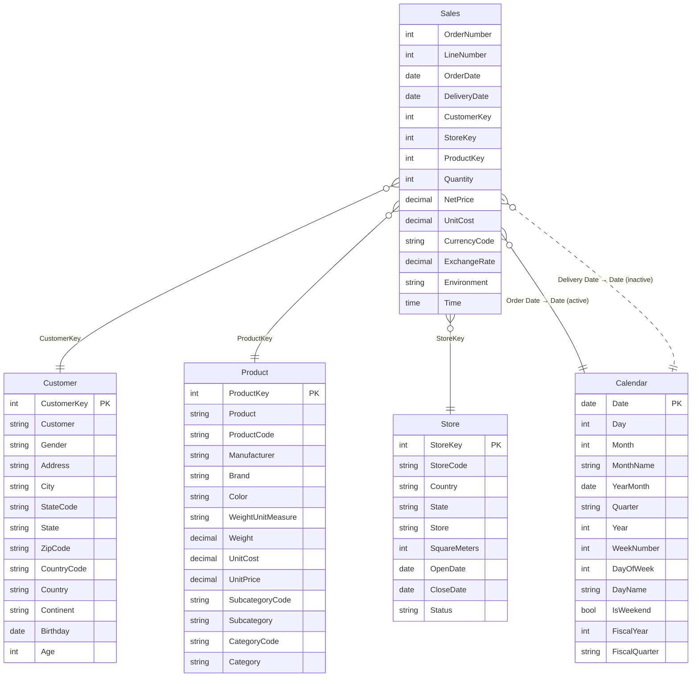

# Sales – Power BI Semantic Model Documentation

> *Auto-generated documentation.*

## Table of Contents
1. [Overview](#overview)
2. [Table Relationships](#table-relationships)
3. [Tables and Columns](#tables-and-columns)
4. [Measures](#measures)
5. [Row-Level Security](#row-level-security)
6. [Data Sources](#data-sources)

---

## Overview

The **Sales** semantic model is a retail analytics model designed to track and analyse sales performance across customers, products, stores, and time. It provides key metrics such as revenue, margin, cost, and customer/product/store counts, with support for time-intelligence calculations and row-level security by store geography.

| Item | Count |
|------|-------|
| Tables | 6 |
| Relationships | 5 |
| Measures | 13 |
| Security Roles | 2 |
| Power Query Parameters | 5 |

---

## Table Relationships

The diagram below illustrates the relationships between tables. `Sales` is the central fact table connected to four dimension tables. The relationship between `Sales[Delivery Date]` and `Calendar[Date]` is inactive (used only via `USERELATIONSHIP` in DAX).



---

## Tables and Columns

### Sales *(Fact Table)*

The central transaction table containing individual sales order lines.

| Column | Data Type | Hidden | Notes |
|--------|-----------|--------|-------|
| Order Number | Integer | No | Sales order identifier |
| Line Number | Integer | No | Line item number within an order |
| Order Date | Date | No | Date the order was placed |
| Delivery Date | Date | No | Date the order was delivered |
| CustomerKey | Integer | Yes | Foreign key to Customer table |
| StoreKey | Integer | Yes | Foreign key to Store table |
| ProductKey | Integer | Yes | Foreign key to Product table |
| Quantity | Integer | Yes | Number of units sold |
| Net Price | Decimal | Yes | Net selling price per unit |
| Unit Cost | Decimal | Yes | Cost per unit |
| Currency Code | String | No | Transaction currency (e.g. USD) |
| Exchange Rate | Decimal | No | Exchange rate applied |
| Environment | String | No | Deployment environment tag (DEV / QUAL / PRD) |
| Time | Time | No | Randomly generated order time |

---

### Customer *(Dimension)*

Customer master data including demographics and geography.

| Column | Data Type | Hidden | Notes |
|--------|-----------|--------|-------|
| CustomerKey | Integer | Yes | Primary key |
| Customer | String | No | Full customer name |
| Gender | String | No | Customer gender |
| Address | String | No | Street address |
| City | String | No | City |
| State Code | String | No | State/province abbreviation |
| State | String | No | Full state/province name |
| Zip Code | String | No | Postal code |
| Country Code | String | No | ISO country code |
| Country | String | No | Full country name |
| Continent | String | No | Continent |
| Birthday | Date | No | Date of birth |
| Age | Integer (calculated) | No | Age derived from Birthday using `DATEDIFF` |

---

### Product *(Dimension)*

Product catalogue with category hierarchy and pricing.

| Column | Data Type | Hidden | Notes |
|--------|-----------|--------|-------|
| ProductKey | Integer | Yes | Primary key |
| Product | String | No | Product name |
| Product Code | String | No | Product SKU code |
| Manufacturer | String | No | Manufacturer name |
| Brand | String | No | Brand name |
| Color | String | No | Product colour |
| Weight Unit Measure | String | No | Unit for weight (e.g. kg, lb) |
| Weight | Decimal | No | Product weight |
| Unit Cost | Decimal | No | Standard cost per unit |
| Unit Price | Decimal | No | Standard selling price per unit |
| Subcategory Code | String | No | Subcategory identifier |
| Subcategory | String | No | Subcategory name |
| Category Code | String | No | Category identifier |
| Category | String | No | Category name |

---

### Store *(Dimension)*

Retail store information including location and operational status.

| Column | Data Type | Hidden | Notes |
|--------|-----------|--------|-------|
| StoreKey | Integer | Yes | Primary key |
| Store Code | String | No | Store identifier code |
| Country | String | No | Country where store is located |
| State | String | No | State/province |
| Store | String | No | Store name |
| Square Meters | Integer | No | Store floor area |
| Open Date | Date | No | Date the store opened |
| Close Date | Date | No | Date the store closed (if applicable) |
| Status | String | No | Operational status (e.g. Open, Closed) |

---

### Calendar *(Date Dimension)*

Dynamically generated date table covering the last three calendar years, with fiscal calendar support (fiscal year starts July).

| Column | Data Type | Hidden | Notes |
|--------|-----------|--------|-------|
| Date | Date | Yes | Primary key — full date value |
| Day | Integer | No | Day of month (1–31) |
| Month | Integer | Yes | Month number (1–12) |
| Month Name | String | Yes | Abbreviated month name (e.g. Jan) |
| Year-Month | Date | No | First day of month (formatted as `mmm yyyy`) |
| Quarter | String | No | Calendar quarter (e.g. Q1) |
| Year | Integer | No | Calendar year |
| Week Number | Integer | No | ISO week number |
| Day of Week | Integer | No | Day of week (1 = Sunday) |
| Day Name | String | No | Full day name (e.g. Monday) |
| Is Weekend | Boolean | Yes | True if Saturday or Sunday |
| Fiscal Year | Integer | Yes | Fiscal year (July–June) |
| Fiscal Quarter | String | No | Fiscal quarter (e.g. FQ1) |

**Hierarchy:** `Year-Month-Day` → Year → Month → Day

---

### About *(Metadata)*

A static reference table with model metadata (developer, version, last refresh timestamp).

| Column | Data Type | Notes |
|--------|-----------|-------|
| Key | String | Metadata label |
| Value | String | Metadata value |
| Order | Integer | Display sort order |

---

## Measures

All measures are organised across the Sales, Product, Customer, and Store tables.

### Sales Table Measures

#### # Customers (w/ Sales)
**Business Logic:** Counts the number of distinct customers who have at least one sales transaction. Useful for understanding active customer reach.

```dax
# Customers (w/ Sales) = DISTINCTCOUNT('Sales'[CustomerKey])
```

---

#### # Sales
**Business Logic:** Counts the total number of individual sales order lines. Represents transaction volume.

```dax
# Sales = COUNTROWS('Sales')
```

---

#### Sales Qty
**Business Logic:** Sums the total number of units sold across all transactions. Indicates overall volume of goods sold.

```dax
Sales Qty = SUM('Sales'[Quantity])
```

---

#### Sales Amount
**Business Logic:** Calculates total revenue by multiplying quantity by net price for each transaction and summing the results. This is the primary revenue KPI.

```dax
Sales Amount = SUMX('Sales', 'Sales'[Quantity] * 'Sales'[Net Price])
```

---

#### Sales Amount (LY)
**Business Logic:** Returns the Sales Amount for the same period in the prior year. Used for year-over-year comparisons. Returns blank when there is no current-year sales amount.

```dax
Sales Amount (LY) =
    IF(
        [Sales Amount] > 0,
        CALCULATE([Sales Amount], SAMEPERIODLASTYEAR('Calendar'[Date]))
    )
```

---

#### Sales Amount Avg per Day
**Business Logic:** Calculates the average daily sales amount over the selected period. Useful for smoothing trends and comparing periods of different lengths.

```dax
Sales Amount Avg per Day = AVERAGEX(VALUES('Calendar'[Date]), [Sales Amount])
```

---

#### Sales Amount (12M average)
**Business Logic:** Calculates the rolling 12-month average daily sales amount ending on the last selected date. Returns blank if the 12-month period starts after the last sales date, ensuring no misleading partial-period averages.

```dax
Sales Amount (12M average) =
VAR v_selDate =
    MAX( 'Calendar'[Date] )
VAR v_period =
    DATESINPERIOD( 'Calendar'[Date], v_selDate, -12, MONTH )
VAR v_result =
    CALCULATE( AVERAGEX( VALUES( 'Calendar'[Date] ), [Sales Amount] ), v_period )
VAR v_firstDate =
    MINX( v_period, 'Calendar'[Date] )
VAR v_lastDateSales =
    MAX( Sales[Order Date] )
RETURN
    IF( v_firstDate <= v_lastDateSales, v_result )
```

---

#### Sales Amount (6M average)
**Business Logic:** Calculates the rolling 6-month average daily sales amount ending on the last selected date. Follows the same guard logic as the 12-month average.

```dax
Sales Amount (6M average) =
VAR v_selDate =
    MAX( 'Calendar'[Date] )
VAR v_period =
    DATESINPERIOD( 'Calendar'[Date], v_selDate, -6, MONTH )
VAR v_result =
    CALCULATE( AVERAGEX( VALUES( 'Calendar'[Date] ), [Sales Amount] ), v_period )
VAR v_firstDate =
    MINX( v_period, 'Calendar'[Date] )
VAR v_lastDateSales =
    MAX( Sales[Order Date] )
RETURN
    IF( v_firstDate <= v_lastDateSales, v_result )
```

---

#### Cost
**Business Logic:** Calculates total cost of goods sold (COGS) by multiplying quantity by unit cost for each transaction.

```dax
Cost = SUMX( Sales, Sales[Quantity] * Sales[Unit Cost] )
```

---

#### Margin
**Business Logic:** Calculates gross profit by subtracting unit cost from net price for each transaction, then summing across all rows. Represents the profitability of sales.

```dax
Margin =
SUMX(
    Sales,
    Sales[Quantity] * ( Sales[Net Price] - Sales[Unit Cost] )
)
```

---

### Product Table Measures

#### # Products
**Business Logic:** Counts the total number of products in the product catalogue.

```dax
# Products = COUNTROWS('Product')
```

---

### Customer Table Measures

#### # Customers
**Business Logic:** Counts the total number of customers in the customer master (including customers with no sales).

```dax
# Customers = COUNTROWS('Customer')
```

---

### Store Table Measures

#### # Stores
**Business Logic:** Counts the total number of stores in the store dimension.

```dax
# Stores = COUNTROWS('Store')
```

---

## Row-Level Security

Two RLS roles are defined, both filtering the **Store** table by country. Users assigned to a role will only see data for stores in their permitted country; all related fact data filters through automatically via the active relationship.

| Role | Table | Filter Expression | Description |
|------|-------|-------------------|-------------|
| Store - Canada | Store | `[Country] == "Canada"` | Restricts data to Canadian stores only |
| Store - United States | Store | `[Country] == "United States"` | Restricts data to US stores only |

> **Note:** Both roles grant `Read` model permission.

---

## Data Sources

All transactional and master data tables are loaded from CSV files hosted at a configurable HTTP base URL. The Calendar table is generated entirely in Power Query, and the About table is hardcoded.

### Power Query Parameters

The following parameters control data loading behaviour and can be adjusted per deployment environment:

| Parameter | Type | Default Value | Description |
|-----------|------|---------------|-------------|
| `HttpSource` | Text | `https://raw.githubusercontent.com/pbi-tools/sales-sample/data/` | Base URL for all CSV source files |
| `RangeStart` | DateTime | `2020-01-01 00:00:00` | Inclusive start date filter applied to the Sales table |
| `RangeEnd` | DateTime | `2024-12-31 00:00:00` | Inclusive end date filter applied to the Sales table |
| `Environment` | Text | `DEV` (options: DEV, QUAL, PRD) | Environment tag stamped onto each Sales row |
| `Randomizer` | Number | `0.6` | Variance factor (0–1) used to randomise quantity and net price values in Sales data |

---

### Table Data Sources

| Table | Source Type | Source Details |
|-------|-------------|----------------|
| **Sales** | HTTP CSV | `{HttpSource}/RAW-Sales.csv` — 13-column sales transactions; dates are shifted to align with the current year; quantity and net price are randomised using the `Randomizer` parameter; rows are filtered by `RangeStart`/`RangeEnd` |
| **Product** | HTTP CSV | `{HttpSource}/RAW-Product.csv` — 14-column product catalogue |
| **Customer** | HTTP CSV | `{HttpSource}/RAW-Customer.csv` — 13-column customer master; `Age` column is dropped in favour of the calculated column |
| **Store** | HTTP CSV | `{HttpSource}/RAW-Store.csv` — 9-column store master |
| **Calendar** | Power Query (generated) | Dynamically generates a date range from 1 January three years ago to 31 December of the current year; enriched with calendar and fiscal attributes |
| **About** | Hardcoded | Static metadata table listing developer, version, description, and last-refresh timestamp |
